# Redis (homelab)

One repo, **two Helm charts** for Redis on Kubernetes:

| Chart | Path | Purpose |
|-------|------|---------|
| **redis-operator** | `operator/` | Spotahome Redis operator — install in **cluster-tools**. Manages RedisFailover CRs. |
| **redis** | `cluster/` | HA Redis + Sentinel — install in **redis** namespace. Hostname `redis-master.redis.svc.cluster.local`. |

---

## 🗺️ Topology

Generated from this repo’s `values.yaml`, `Chart.yaml` and `argocd/` manifests. Source: [`docs/img/topology.mmd`](docs/img/topology.mmd). Deployed by Argo CD into namespace `cluster-tools`.

## Install order

1. **operator:** `helm install redis-operator ./operator -n cluster-tools -f operator/values.yaml`
2. **cluster:** `helm install redis ./cluster -n redis -f cluster/values.yaml`

Argo CD: use two Applications (or one app per path), e.g. path `operator` and path `cluster` with the appropriate namespaces.

---

## Requirements

- **operator:** namespace `cluster-tools`.
- **cluster:** namespace `redis`, nodes with label `node-role=database` (soft affinity). PDBs limit disruption to one pod at a time.

See **operator/README.md** and **cluster/README.md** for per-chart details.
